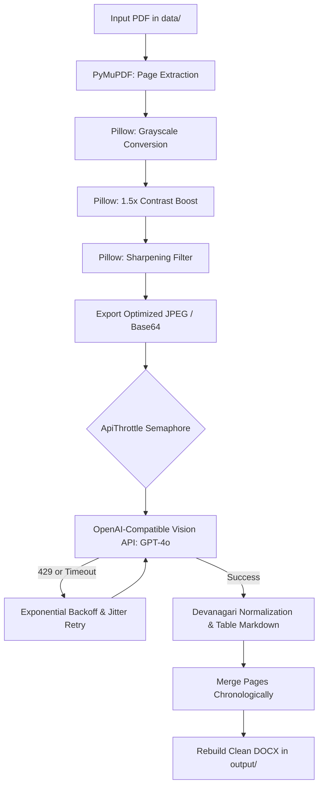

# 🇳🇵 Nepali Devanagari OCR Pipeline

[](https://www.python.org/)
[](LICENSE)
[](Dockerfile)
[]()
[]()

A high-accuracy, high-throughput PDF → DOCX optical character recognition pipeline designed for scanned Nepali Devanagari documents (laws, legal gazettes, court rulings, and government archives). Powered by OpenAI-compatible vision models (e.g. `GPT-4o`), the pipeline preprocesses pages, manages rate-limited concurrent API calls, handles complex legal document hierarchies, and exports clean, continuous DOCX documents ready for direct embedding into RAG vector databases (such as ChromaDB, Pinecone, or Qdrant).

---

## 📑 Table of Contents

- [Architecture & How It Works](#-architecture--how-it-works)
- [Key Features](#-key-features)
- [Prerequisites](#-prerequisites)
- [Installation](#-installation)
  - [Native Setup (Linux / macOS / Windows)](#1-native-setup)
  - [Docker Setup](#2-docker-containerized-setup)
- [Environment Configuration](#-environment-configuration)
- [Usage Guide & Examples](#-usage-guide--examples)
- [CLI Reference](#-cli-reference)
- [Why RAG-Optimized?](#-why-rag-optimized)
- [Troubleshooting & FAQ](#-troubleshooting--faq)
- [License](#-license)

---

## 🏛 Architecture & How It Works

The pipeline ingests raw multi-page scanned PDFs and outputs structured, clean `.docx` documents through a multi-stage process:

```
┌──────────────┐     ┌───────────────────────┐     ┌────────────────────────┐
│  Source PDF  │ ──> │ PyMuPDF (fitz) Render │ ──> │  Pillow Preprocessing  │
│   Document   │     │  Rasterize @ 240 DPI  │     │ Grayscale + Boost +    │
└──────────────┘     └───────────────────────┘     │     Sharpen Edge       │
                                                   └───────────┬────────────┘
                                                               │ Base64 Encoded
                                                               ▼
┌──────────────┐     ┌───────────────────────┐     ┌────────────────────────┐
│  Clean DOCX  │ <── │ Devanagari Formatting │ <── │  Throttled Vision API  │
│ (RAG Ready)  │     │ Reflow lines, tables, │     │  GPT-4o / Vision LLM   │
└──────────────┘     │   legal numbering     │     │ Paced & Retry Backoff  │
                     └───────────────────────┘     └────────────────────────┘
```



---

## ✨ Key Features

- **Specialized Devanagari Vision Prompting**: Accurately disambiguates visually similar Devanagari glyphs (such as ण↔न, ष↔स, ब↔व, भ↔म, घ↔प, छ↔इ) and preserves full Nepali Unicode legal numbering (`१.`, `२.`, `(१)`, `(क)`, `(ख)`).
- **Automated Table Extraction**: Converts complex tabular data into GitHub-flavored Markdown tables and automatically reproduces column headers across multi-page continuations.
- **RAG-First Paragraph Reflow**: Reconstructs broken sentences and narrow-column line wraps into natural paragraphs without artificial page separators or headers that contaminate semantic vector chunks.
- **Two-Tier Parallelism with Global Throttling**: Process multiple PDFs concurrently while processing multiple pages per PDF, backed by a global bounded semaphore (`ApiThrottle`) and request start pacing (`--api-min-interval`) to avoid provider rate limits.
- **Image Preprocessing Pipeline**: Automatically converts pages to grayscale, applies a 1.5x contrast boost, and sharpens character boundaries to maximize OCR recall while minimizing payload size.
- **Resilient Resume & Retries**: Skips already-processed files automatically (override with `--force`) and implements exponential backoff with random jitter for transient errors and HTTP 429 rate limits.
- **Universal Provider Compatibility**: Works seamlessly with [FreeModel](https://freemodel.dev), official [OpenAI](https://platform.openai.com), [OpenRouter](https://openrouter.ai), or any self-hosted OpenAI-compatible vision endpoint (e.g., vLLM, Ollama).

---

## 📦 Prerequisites

- **Python**: 3.10 or higher
- **Package Manager**: `pip`
- **Docker** *(optional)*: Engine 20.10+ if using containerized execution
- An API key for an OpenAI-compatible vision model provider (FreeModel, OpenAI, or OpenRouter)

---

## 🚀 Installation

### 1. Native Setup

#### Linux / Ubuntu / Debian
```bash
# Clone the repository
git clone https://github.com/ajaymahato431/pdf_ocr.git
cd pdf_ocr

# Create and activate a virtual environment
python3 -m venv .venv
source .venv/bin/activate

# Install dependencies
pip install --upgrade pip
pip install -r requirements.txt
```

#### macOS (Apple Silicon / Intel)
```bash
# Clone the repository
git clone https://github.com/ajaymahato431/pdf_ocr.git
cd pdf_ocr

# Create and activate a virtual environment
python3 -m venv .venv
source .venv/bin/activate

# Install dependencies
pip install --upgrade pip
pip install -r requirements.txt
```

#### Windows (PowerShell / Command Prompt)
```powershell
# Clone the repository
git clone https://github.com/ajaymahato431/pdf_ocr.git
cd pdf_ocr

# Create and activate virtual environment
python -m venv .venv
.venv\Scripts\Activate.ps1

# Install dependencies
python -m pip install --upgrade pip
pip install -r requirements.txt
```

---

### 2. Docker (Containerized Setup)

Build the lightweight container image locally:

```bash
docker build -t pdf-ocr:latest .
```

Run with your local `.env` and directory mounts:

```bash
docker run --rm -it \
  --env-file .env \
  -v "$(pwd)/data:/app/data" \
  -v "$(pwd)/output:/app/output" \
  pdf-ocr:latest
```

*(On Windows PowerShell, replace `"$(pwd)/data"` with `"${PWD}/data"`)*

---

## ⚙️ Environment Configuration

Copy the example template to create your `.env` file:

```bash
cp .env.example .env
```

Open `.env` and fill in your configuration:

```ini
# ==========================================
# API Provider Credentials & Base URL
# ==========================================
# Use either FREEMODEL_API_KEY or OPENAI_API_KEY
FREEMODEL_API_KEY=your_freemodel_api_key_here
# OPENAI_API_KEY=your_openai_api_key_here

# API Base URL (default: FreeModel)
OPENAI_BASE_URL=https://api.freemodel.dev/v1

# Vision Model Name
OCR_MODEL=gpt-4o

# ==========================================
# Concurrency & Performance Tuning
# ==========================================
OCR_PAGES_PARALLEL=2
OCR_PDFS_PARALLEL=1
OCR_API_PARALLEL=1
OCR_API_MIN_INTERVAL=5.0

# ==========================================
# Rendering & Image Quality
# ==========================================
OCR_DPI=240
OCR_IMAGE_FORMAT=jpeg
OCR_JPEG_QUALITY=90
OCR_IMAGE_DETAIL=auto

# ==========================================
# Timeouts & Retries
# ==========================================
OCR_REQUEST_TIMEOUT=180
OCR_RETRIES=3
OCR_RETRY_BASE_DELAY=5.0
OCR_RETRY_MAX_DELAY=60.0

# ==========================================
# Directory Paths
# ==========================================
OCR_INPUT_DIR=data
OCR_OUTPUT_DIR=output
```

> [!TIP]
> Configuration values follow strict precedence:
> **CLI Arguments** > **`.env` / Environment Variables** > **Built-in Defaults**.

---

## 💡 Usage Guide & Examples

Place your PDF files into the `data/` folder (or specify any folder with `--input`), then run the pipeline:

### Basic Execution
Process all PDFs in `data/` and write outputs to `output/`:
```bash
python ocr_pipeline.py
```

### Force Re-Processing
By default, the pipeline skips PDFs whose `.docx` outputs already exist. To overwrite:
```bash
python ocr_pipeline.py --force
```

### High-Throughput Mode (Paid Tier / High Rate Limits)
If your API key has high concurrency limits:
```bash
python ocr_pipeline.py \
  --pages-parallel 4 \
  --pdfs-parallel 2 \
  --api-parallel 4 \
  --api-min-interval 1.0
```

### Conservative Mode (Free Tier / Strict Rate Limits)
For tier-1 or free API keys with strict RPM limits:
```bash
python ocr_pipeline.py \
  --pages-parallel 1 \
  --pdfs-parallel 1 \
  --api-parallel 1 \
  --api-min-interval 6.0 \
  --retries 5
```

### Custom Input/Output Directories & Model Override
```bash
python ocr_pipeline.py \
  --input /path/to/nepal_gazettes \
  --output /path/to/extracted_docx \
  --model gpt-4o-mini \
  --dpi 200
```

---

## 📖 CLI Reference

| Flag | Environment Variable | Type | Default | Description |
|---|---|:---:|:---:|---|
| `--api-key` | `OPENAI_API_KEY` / `FREEMODEL_API_KEY` | `str` | `None` | API authentication key for vision endpoint |
| `--base-url` | `OPENAI_BASE_URL` / `FREEMODEL_BASE_URL` | `str` | `https://api.freemodel.dev/v1` | Endpoint base URL for OpenAI-compatible API |
| `--model` | `OCR_MODEL` | `str` | `gpt-4o` | Vision model identifier |
| `--input` | `OCR_INPUT_DIR` | `str` | `data` | Directory containing source `.pdf` files |
| `--output` | `OCR_OUTPUT_DIR` | `str` | `output` | Directory where `.docx` files will be saved |
| `--dpi` | `OCR_DPI` | `int` | `240` | Rasterization resolution for PDF pages |
| `--image-format` | `OCR_IMAGE_FORMAT` | `choice` | `jpeg` | Encoded page format (`jpeg` or `png`) |
| `--jpeg-quality` | `OCR_JPEG_QUALITY` | `int` | `90` | JPEG compression quality (1-95) |
| `--image-detail` | `OCR_IMAGE_DETAIL` | `choice` | `auto` | Vision detail hint (`auto`, `low`, `high`) |
| `--pages-parallel`| `OCR_PAGES_PARALLEL` | `int` | `2` | Concurrent pages processed per PDF |
| `--pdfs-parallel` | `OCR_PDFS_PARALLEL` | `int` | `1` | Concurrent PDFs processed simultaneously |
| `--api-parallel` | `OCR_API_PARALLEL` | `int` | `1` | Global maximum concurrent API requests |
| `--api-min-interval` | `OCR_API_MIN_INTERVAL` | `float`| `5.0` | Minimum seconds between API request starts |
| `--request-timeout` | `OCR_REQUEST_TIMEOUT` | `float`| `180.0` | HTTP request timeout in seconds |
| `--retries` | `OCR_RETRIES` | `int` | `3` | Maximum retry attempts per page |
| `--retry-base-delay`| `OCR_RETRY_BASE_DELAY` | `float`| `5.0` | Initial exponential backoff delay in seconds |
| `--retry-max-delay` | `OCR_RETRY_MAX_DELAY` | `float`| `60.0` | Maximum cap for retry delay |
| `--force` | — | `flag` | `False` | Overwrite existing output `.docx` files |

---

## 🎯 Why RAG-Optimized?

Standard OCR tools often produce broken text lines, random headers/footers, and arbitrary page breaks. When ingested into vector databases (e.g., ChromaDB, LangChain, LlamaIndex), this causes severe problems:

1. **Broken Sentence Embeddings**: A sentence broken across lines or pages splits across different embedding chunks, destroying semantic meaning.
2. **Hallucinated Retrieval**: Headers, footers, and page numbers match user queries instead of the substantive legal text.
3. **Table Scrambling**: Tables extracted as free text lose column association.

### How this pipeline solves it:
- **Continuous Paragraph Flow**: Wrapped sentences are reflowed into clean, coherent paragraphs.
- **Markdown Tables**: Retains table semantics so embeddings understand structured columns and rows.
- **Devanagari Legal Structure**: Preserves exact Nepali statutory numbering (`दफा`, `उपदफा`, `खण्ड`, `अनुसूची`) enabling accurate hierarchical chunking in downstream RAG chunkers (such as recursive structure splitters).

---

## 🔧 Troubleshooting & FAQ

### Q: I am getting `429 Rate Limit Exceeded` errors.
- Increase the spacing between calls: `--api-min-interval 8.0`
- Limit API concurrency: `--api-parallel 1`
- Increase retry count: `--retries 5`

### Q: The script fails with `❌ Error: No API key found.`
- Ensure you created a `.env` file from `.env.example`: `cp .env.example .env`
- Verify that `FREEMODEL_API_KEY` or `OPENAI_API_KEY` is set inside `.env`.
- Alternatively, pass the key directly on the command line: `--api-key "your_key"`.

### Q: Pages take too long to upload or process.
- Use JPEG format instead of PNG: `--image-format jpeg`
- Slightly reduce the DPI: `--dpi 200`
- Set JPEG quality to 85: `--jpeg-quality 85`

### Q: Can I use this with OpenAI directly instead of FreeModel?
Yes! In your `.env`:
```ini
OPENAI_API_KEY=sk-proj-...
OPENAI_BASE_URL=https://api.openai.com/v1
OCR_MODEL=gpt-4o
```
Or via CLI:
```bash
python ocr_pipeline.py --api-key "sk-proj-..." --base-url "https://api.openai.com/v1" --model "gpt-4o"
```

---

## 📄 License

This project is licensed under the terms of the [MIT License](LICENSE).
Feel free to use, modify, and distribute it for academic, personal, or commercial applications.
